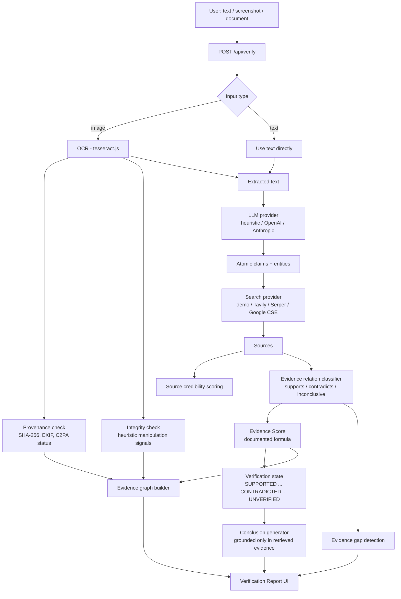

# ProofChain

**Don't ask AI whether something is true. Make AI prove it.**

ProofChain is an evidence verification layer, not a chatbot. You give it a claim, a
screenshot, or a document; it gives you back a traceable chain — claim → atomic
claims → evidence → source quality → supporting/contradicting evidence →
provenance/integrity signals → evidence score → explanation → source trail —
that you can inspect yourself. It never simply says "true" or "false."

---

## 1. The problem

AI can generate convincing text. Screenshots get fabricated. Claims spread faster
than anyone can check them. Most AI tools respond to this by handing you *another*
opinion: "here's what I think." That's not verification, it's just a second guess.

## 2. The solution

ProofChain treats verification as a pipeline with visible stages, not a single
model call:

```
Claim / screenshot / document
        │
        ▼
  OCR + text extraction
        │
        ▼
  Atomic claim decomposition
        │
        ▼
  Evidence retrieval (supporting AND contradicting, on purpose)
        │
        ▼
  Source credibility scoring
        │
        ▼
  Provenance (SHA-256, EXIF, C2PA) + integrity signals (uploads only)
        │
        ▼
  Transparent Evidence Score (documented formula, not an LLM confidence guess)
        │
        ▼
  Verification Report + interactive Evidence Graph + source trail
```

If the evidence isn't there, ProofChain says **INSUFFICIENT EVIDENCE** instead of
inventing an answer.

---

## 3. Architecture



### Module layout

```
/app
  page.tsx                   Home
  /verify/page.tsx            Claim/screenshot input + live pipeline stages
  /report/[id]/page.tsx       The verification report (primary UI)
  /history/page.tsx           Past verifications
  /api/verify/route.ts        POST — runs the full pipeline
  /api/verify/[id]/route.ts   GET/DELETE a single verification
  /api/history/route.ts       GET — list past verifications

/lib
  /types                      Shared domain types (VerificationRecord, etc.)
  /ai/provider.ts              LLM abstraction: heuristic (default) / OpenAI / Anthropic
  /search/provider.ts           SearchProvider abstraction: demo (default) / Tavily / Serper / Google CSE
  /evidence/classify.ts         Relation (supports/contradicts) + directness heuristics
  /ocr/index.ts                 tesseract.js OCR
  /provenance/index.ts           SHA-256 + EXIF + C2PA status
  /integrity/index.ts            Manipulation-signal heuristics
  /scoring/index.ts              Transparent Evidence Score formula
  /pipeline/verify.ts            Orchestrates every stage end to end
  /pipeline/conclusion.ts        Evidence-grounded conclusion + gap detection
  /pipeline/buildGraph.ts        Evidence graph construction
  /security/index.ts             Upload validation, prompt-injection flags, SSRF guard, timeouts
  /store/index.ts                JSON-file dev "database" (see §7)
  /demo/seedCases.ts             Labeled Demo Mode seed data

/components
  /verification                Stage tracker, state badge
  /evidence                    Evidence cards, credibility stars
  /report                      Score dial + factor breakdown
  /graph                       Interactive SVG evidence graph

/prisma/schema.prisma          Reference Postgres schema for production
```

---

## 4. AI architecture (staged, not one giant prompt)

Claim handling is split into discrete stages, each producing a validated,
structured output that the next stage consumes — never a single free-form
"tell me if this is true" prompt:

1. **Input understanding** — OCR / raw text
2. **Claim extraction** — main claim
3. **Atomic decomposition** — independently-verifiable sub-claims, each tagged
   with category and importance
4. **Search query generation** — one retrieval query per atomic claim
5. **Evidence extraction** — snippet + publisher + date per result
6. **Evidence classification** — supports / contradicts / inconclusive, direct / indirect
7. **Contradiction detection** — explicit, not incidental
8. **Evidence-gap detection** — when to say "insufficient evidence"
9. **Report generation** — deterministic template grounded only in stages 1–8's
   structured output (see §5 — the conclusion is never freely generated by an
   LLM from scratch)

The LLM provider (`lib/ai/provider.ts`) is used only for stage 3, and only
returns JSON validated against a fixed shape. **If no `ANTHROPIC_API_KEY` or
`OPENAI_API_KEY` is set, or if the LLM call fails or times out, a fully
deterministic rule-based decomposition engine runs instead** — this is why the
whole app works with zero API keys.

## 5. Hallucination control

- Every evidence item is tied to a `sourceId` that points to a real retrieved
  URL — there is no code path that lets the LLM invent a source, quote, date,
  or statistic into an `Evidence` record.
- The final conclusion (`lib/pipeline/conclusion.ts`) is a **template filled
  from already-retrieved structured data** (top sources, counts, score), not
  a fresh LLM generation — so it can't drift from the evidence that's actually
  on screen.
- Evidence items carry a `verified` flag; anything that can't be tied to a
  real retrieval is marked `UNVERIFIED` and factored into the score as an
  uncertainty penalty rather than being dropped silently.
- Retrieved web content and OCR text are wrapped as `<untrusted_data>` before
  ever reaching an LLM prompt, and the system prompts explicitly instruct the
  model to treat that content as data, not instructions (prompt-injection
  resistance — see `lib/security/index.ts`).

## 6. Evidence Score — the actual formula

Documented in `lib/scoring/index.ts`, computed from measurable retrieval
signals — **never** "ask the LLM how confident it is":

```
score = sourceAuthority(0-30)      average credibility of cited sources
      + evidenceAgreement(0-25)    supporting vs. contradicting ratio
      + sourceIndependence(0-15)   unique publishers / citations
      + freshness(0-10)            recency of cited sources
      + directness(0-10)           evidence that directly addresses the claim
      + baseline(10)               fixed floor so thin evidence ≠ "disproven"
      - contradictionPenalty(0-25) scaled by contradicting-source credibility
      - uncertaintyPenalty(0-15)   unverified / inconclusive evidence
  clamped to [0, 100]
```

Every factor is shown with its exact contribution and a plain-English reason
on the report page. This is an **Evidence Score**, explicitly not a "truth
probability."

## 7. Database: what's actually running vs. the reference schema

This build ships with a **JSON-file-backed store**
(`lib/store/index.ts`, → `data/db/verifications.json`) instead of a live
Postgres instance, so the whole app runs with zero infrastructure — clone,
`npm install`, `npm run dev`, done.

`prisma/schema.prisma` contains the intended production schema (User,
Verification, InputFile, Claim, Source, Evidence, ProvenanceCheck,
IntegrityCheck). Moving to it is mechanical: point `DATABASE_URL` at a real
Postgres instance (e.g. Neon or Supabase), run `npx prisma migrate dev`, and
reimplement the ~6 functions in `lib/store/index.ts` against
`prisma.verification.*` — every API route and page only depends on that
store interface, so nothing else changes.

## 8. Security

- API keys are read from `process.env` only, server-side; never sent to the
  client.
- Uploads are restricted by MIME type and a 15MB size cap
  (`lib/security/index.ts`).
- OCR output is stripped of control characters before storage/display.
- Retrieved web content and document text are treated as untrusted data and
  wrapped before reaching any LLM prompt, specifically to resist "ignore
  previous instructions"-style injection from a malicious source page.
- A basic SSRF guard blocks localhost/private-IP targets for any future
  "verify this URL" feature.
- Every external call (OCR, LLM, search) is wrapped with a timeout so a
  hung network request degrades to a clean error instead of stalling the
  pipeline.
- Simple in-memory rate limiting on `POST /api/verify` (12 requests/minute
  per IP) — swap for a real store (Redis, Upstash) in production.

## 9. Demo Mode

Three labeled, realistic misinformation cases ship out of the box
(`lib/demo/seedCases.ts`):

1. **Fake government announcement** — a viral ₹5000-note claim, contradicted
   by RBI and Reuters.
2. **Misleading health claim** — a vague vaccine-ingredient scare, contradicted
   by WHO and BBC.
3. **Election fraud claim** — a certified-results dispute, contradicted by AP
   and PolitiFact.

Every demo-sourced record is labeled `isDemo: true` and shown with a visible
"Demo data" banner on the report — **including** the case where no search API
key is configured and the app automatically falls back to demo retrieval for
a real (non-demo) claim. ProofChain never presents seed data as if it were a
live result.

## 10. Known limitations

- **No live search/LLM APIs wired to real accounts in this build** — add keys
  to `.env.local` to activate Tavily/Serper/Google CSE and OpenAI/Anthropic;
  everything else (scoring, graph, report, provenance, integrity) works
  identically either way.
- **PDF/document upload isn't wired to OCR** in this pass — the API rejects
  PDFs with a clear message; paste the text or upload a screenshot instead.
- **C2PA Content Credentials verification isn't implemented** — reported
  honestly as "not available," never faked as "no manifest found."
- **Evidence relation classification for real (non-demo) search results is
  lexical/heuristic**, not model-based — conservative by design (defaults to
  "inconclusive" rather than guessing "supports"), but a production build
  would use an LLM classification stage with the same JSON-validated
  contract as claim decomposition.
- **JSON-file store, not Postgres** — see §7 for the swap path.
- **Rate limiting is in-memory** — fine for a single instance/demo, not for
  a multi-instance production deployment.

## 11. Future roadmap

- Wire PDF/document OCR and multi-page evidence extraction.
- Replace the lexical evidence-relation classifier with an LLM-based
  classification stage (same structured-JSON pattern as claim decomposition).
- C2PA Content Credentials verification via `c2pa-node`.
- Real Postgres + Prisma persistence, S3/Supabase file storage.
- Per-claim confidence intervals and historical drift tracking for
  repeatedly-checked claims.
- Optional auth (Clerk/Auth.js) for private verification history.

---

## 12. Setup — step by step

### Prerequisites

- Node.js 18.18+ (built and tested on Node 22)
- npm

### 1. Install dependencies

```bash
cd proofchain
npm install
```

### 2. Configure environment (optional — the app works with none of these set)

```bash
cp .env.example .env.local
```

Leave everything blank to run entirely on the heuristic claim engine + Demo
Mode search fallback. To activate real providers, fill in whichever you have:

```
ANTHROPIC_API_KEY=...      # or OPENAI_API_KEY
TAVILY_API_KEY=...         # or SERPER_API_KEY, or GOOGLE_SEARCH_API_KEY + GOOGLE_SEARCH_ENGINE_ID
DATABASE_URL=...           # only needed if you've swapped in the Prisma store, see §7
```

### 3. Run locally

```bash
npm run dev
```

Open [http://localhost:3000](http://localhost:3000).

### 4. Try it

- Go to **/verify**, click one of the three **Demo Mode** cards, and click
  "Verify with ProofChain" — no API keys required.
- Or paste your own claim, or upload a screenshot (JPEG/PNG/WEBP/GIF, up to
  15MB) — OCR, provenance (SHA-256/EXIF), and integrity heuristics all run
  for real on real uploads.
- Watch the live stage tracker, then land on the full **Verification
  Report**: score, atomic claims, supporting/contradicting evidence, source
  quality table, interactive evidence graph, provenance, integrity, evidence
  gaps, and the full evidence trail.
- Check **/history** to revisit or delete past verifications.

### 5. Production build

```bash
npm run build
npm start
```
